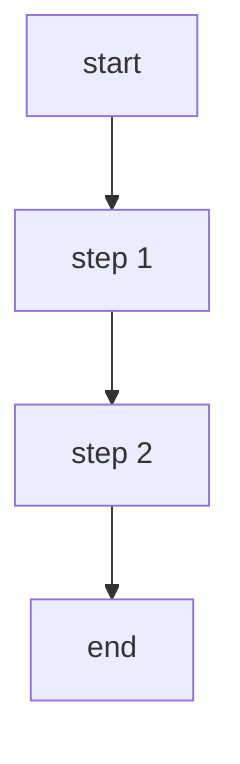

## 前言

- 以使用者的角度看待问题
- 包含技术和一些工具

## 新的事物一定会更好么？

> 历史是螺旋上升的，新事物总是解决一些问题，然后带来新的问题。

- 工具软件：[小众软件](https://meta.appinn.net/)，[异次元软件世界](https://www.iplaysoft.com/)，[善用佳软](https://xbeta.info/)
- 大而全还是小而美: 应该选择 IDE 还是库提供的功能？: eslint/prettier/git hooks

技术

- babel: 在 v5 可以一次引入全部，在 v6 划分为许多零碎的小模块，由于对开发者使用及其不友好，v7 又支持了类似 v5 的使用方式
- husky: v4 支持在 package.json 中定义 git hooks，v5 突发奇想使用原生 git hooks 语法，v6 又撤销回去了
- mobx: 在 v5 使用装饰器，v6 再次回到了高阶函数
- tailwind css: 几年前就有 atomic css 的概念了，不过那时候被喷，但最近似乎又流行了
- vscode: 开源的 eclipse 被 JetBrains IDE 干掉之后，后面 vscode 又流行了起来
- 客户端: 原生程序(windows/qt) => web(react/vue) => web 技术跨平台(electron/react-native) => 非 web 技术跨平台(flutter/kotlin desktop)
- 虚拟 dom: 模板引擎 => react/vue => svelte
- 状态管理: 可变 ng => 不可变 react/redux/immer => 可变 vue/mobx

## 工具

对比

| 类型  | 基于 DSL                 | 所见即所得                 |
| --- | ---------------------- | --------------------- |
| 文档  | markdown               | word/google docs      |
| 绘图  | mermaid/uml/c4model    | drawio/思维导图/google 绘图 |
| 笔记  | vscode/基于 markdown 的工具 | notion/印象笔记           |
| PPT | revealjs/slidev        | PPT                   |

问题：如何平衡自由度和易用性？

### 文档

问题

- 是否使用富文本？
- 是否支持所见即所得？

选择

- markdown 限制了富文本的功能，并将允许的功能做到最好。
- 然而 markdown 抛弃了富文本而使用纯文本，所以也衍生出 UI 是富文本，底层是 markdown 的思路所见即所得编辑器，例如 Typora、Notion 这些。
- word/google docs 这种富文本工具有个痛苦的点是布局非常烦人，想要实现精美的布局需要非常高的熟练度和大量的时间，甚至可以做到 markdown 无法做的效果。但话又说回来，很多人并不能把 word 玩的非常熟，只能制作简单的文档罢了。

下图为在 vscode 中编辑 markdown


### 绘图

问题

- 是否要使用 DSL 渲染绘图？
- 是否使用自动布局算法？

选择

- mermaid/uml/c4model：通过 DSL 渲染各种图表，但通常编辑能力非常有限。由于实际数据是文本，所以能够非常方便的编程式处理。
- drawio/google 绘图：完全自由的一块画布，可以任意拖拽自由布局，但为了减轻调整细节的麻烦，所以都实现了自动对齐的功能。扩展性方面取决于官方支持，如果有 sdk 就还好。
- 思维导图：比较好的平衡了布局的自由和便利，可以拖拽控制位置，但布局仍然是自动的，这是吾辈认为绘图工具中最好的一种实现。

下面是使用 drawio 绘制流程图和使用百度脑图绘制思维导图的区别

````md

````


一些需求

- 所见即所得
- 实际存储的是文本（或提供 sdk 支持）
- 支持控制相对位置，但仍然自动布局

## 技术

| 类型   | 新兴技术    | 相对传统的技术        |
| ---- | ------- | -------------- |
| 打包工具 | esbuild | rollup/webpack |
| 框架   | svelte  | react/vue      |

### 打包工具

问题

- 是否使用 js 编写？
- 是否灵活优先于用户体验？

选择

esbuild、rollup、webpack 它们的选择其实很有意思。

- webpack：生来就以强大的灵活性自居，在 2018 年尝试接触 webpack 时感觉很麻烦，转而使用不需要 webpack 的 vue。但由于其它打包工具的影响（rollup/parcel），后来也声称支持了零配置，但实际上还是有非常非常多的配置，甚至衍生出了 [webpack 配置工程师](https://www.zhihu.com/question/267908710) 这个梗。正因如此，create-react-app/vue-cli 都以 webpack 作为底层二次封装 cli。
- rollup: rollup 本身相比于 webpack 没有那么多配置，复杂度要低得多。尤其是它的许多插件都是真正意义上的支持开箱即用，默认不需要配置即可使用。而且它没有什么难懂的概念，基本上就是指定 input 和 output 就打包好了。但它仍然是使用 js 实现，所以性能方面有一些提升，但不是质的变化。
- esbuild: 完全采取了新的做法，使用 golang 编写，利用多线程加速，导致它比基于 js 的方案快 10-100 倍，实测单独使用时也确实可以做到。而且 vite/snowpack 这些新型的脚手架都使用它去编译 ts/js 以提高性能，最近更是出现了爆发式的生态建设（吾辈之前也在 [@liuli-util/cli](https://www.npmjs.com/package/@liuli-util/cli) 中尝试过）。但这样做也不是全无问题，首先它脱离了现有生态重新实现，导致打包功能并不完善，所以 vite 仅利用它去编译 ts/js 而非整个打包，参考：[为何不用 ESBuild 打包？](https://cn.vitejs.dev/guide/why.html#why-not-bundle-with-esbuild)。

总的来说，rollup 是目前最好用的基于 js 的打包工具，而 esbuild 则非常值得观望 -- 如果社区生态能够成熟起来，则打包性能会飞速提升，前端开发也可能不得不多学一两门其它语言了（golang/rust）。

### 框架

问题

- 是否基于虚拟 dom？
- 生态是否成熟？
- 官方的设计理念是怎么样的？

选择

> 关于这三个框架 vue 作者曾经也做过一些对比，参考 [dotJS 2019 - Evan You - State of Components](https://youtu.be/bOdfo5SmQc8)
> 吾辈曾经从 vue => react 的一些想法：[面相 vue 开发者的 react 入坑指南](/p/f7599ffb024149e1a8928b61e8fdcd42)

- react: 最流行的前端框架，生态非常成熟，但官方更倾向于无为而治，强调哲学与设计理念而非开发者体验。
- svelte: 去年非常火的一个前端框架，倾向于使用编译器在编译阶段做更多的事，避免虚拟 dom 运行时的存在。生态上还非常小，jetbrains 目前没有官方支持它。

### 前端那些曾经流行过的技术

> 参考：[2015 有哪些目前流行的前端框架？](https://www.zhihu.com/question/35069742)

看看还认识几个


- 模块加载方案：CommonJS、AMD、UMD、System
- 打包工具：Gulp、Grunt、browserify
- 框架：jQuery、Prototype、AngularJS、BootStrap、Underscore.js

正在衰落的技术

- Webpack：Vue 作者的脚手架工具已经彻底放弃，这带来了非常大的变化，参考：<https://twitter.com/TheLarkInn/status/1255686575121330176>
- Redux：同样的，redux 作者也表示 redux 过度灵活和复杂化了，参考：<https://twitter.com/dan_abramov/status/1039570011986321408>

## 总结

新事物不断出现，有些是更好的，但有更多会湮没在历史中。选择合适的新事物去学习和使用，比单纯的东做一点、西做一点更有效果（选择比努力更重要）。
