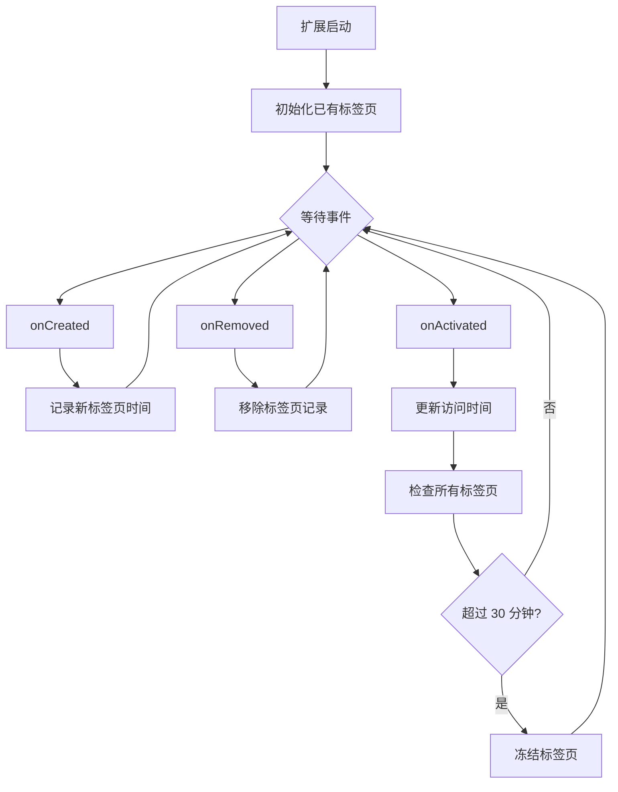

## 前言

在上一章 [Browser Extension Dev - 03. 注入 UI](/p/5cb6d59a968a449b9fa2c003b9f4c48a) 中，我介绍了如何向网页中注入自定义的 UI，同时还了解了如何使用 Shadow DOM、Tailwind CSS 和使用 npm 包。在本章，我将介绍 Background Script，这是扩展的核心元素之一。

首先，什么是 Background Script？

顾名思义，这是扩展可以在后台运行的脚本，与注入到网页的脚本有所不同，它有几个显著的特点：

1. 可以访问所有扩展 API，在扩展的其他部分，例如 Content Script，可以访问的扩展 API 极其受限，例如无法访问 tabs API 来获取当前浏览器所有打开的标签页。
2. 全局唯一，对于 Content Script 而言，在多个标签页中可能会被注入多次，但 Background Script 始终保持唯一，它不会同时存在多个。
3. 按需启动，在 Manifest V3 之后，Background Script 更改为基于事件的模型，也就是说，没有事件传入时（例如，扩展可以监听新标签页的打开事件），它会自动休眠节省资源
4. 无法使用 DOM API，这点不太明显，虽然 Background Script 确实在浏览器环境，可以使用有限的 Web API，但无法访问 DOM，尽管确实有几个替代选项（jsdom/Offscreen）
5. 可以和扩展其他部分通信，Background Script 能与 Content Script、Popup Page 等部分通信，但其他部分之间却不能直接通信，所以需要 Background Script 中转

> 参考：
> Background 简介：<https://developer.chrome.com/docs/extensions/develop/concepts/service-workers>（Manifest V3 后 Chrome 官方改名为 extension service workers，但通常还是习惯称呼为 Background Script）
> Manifest V3 简介：<https://developer.chrome.com/docs/extensions/develop/migrate/what-is-mv3>

上面就是 Background Script 的几个关键点，接下来我将实现一个自动休眠不活跃标签页的扩展来演示它，下面是将会涉及到的 Tabs API，参考 <https://developer.chrome.com/docs/extensions/reference/api/tabs>

## 思考

首先，我们该如何定义不活跃的标签页？

从简单的角度来说，一个长时间没有访问的标签页就是不活跃的，例如最后一次访问标签页还是 30 分钟之前，那么应该可以认为是不活跃的了。如何知道标签页的最后访问时间呢？这就需要监听标签页相关的事件了，下面是涉及到的三个基本事件：

onCreated => 将标签页信息添加到扩展记录中
onRemoved => 从扩展记录的标签页列表中移除
onActivated => 更新标签页的最后访问时间

在长时间不活跃之后，我们可以自动冻结它，浏览器允许在不关闭标签页的情况下自动从内存中驱逐，再次访问时会自动重新加载。



> 注意：Tabs API 本身提供了 `lastAccessed` 字段查看标签页的最后访问时间，但这个字段在 Safari 浏览器并不支持，参考 <https://developer.mozilla.org/en-US/docs/Mozilla/Add-ons/WebExtensions/API/tabs/Tab#browser_compatibility>

## 实现

由于在之前的章节中已经说明过如何初始化扩展，这里不再赘述初始化过程。

```sh
# init project
pnpm dlx wxt@latest init 04-background-script --template vanilla --pm pnpm
```

```ts
// wxt.config.ts
import { defineConfig } from 'wxt'

export default defineConfig({
  manifestVersion: 3,
  manifest: {
    name: 'Auto Sleep Tabs',
    description:
      'Automatically puts inactive tabs to sleep to save memory and CPU.',
  },
  webExt: {
    disabled: true,
  },
})
```

### 监听标签页事件

首先打开 entrypoints/background.ts，可以看到 WXT 初始化的代码。

```ts
export default defineBackground(() => {
  console.log('Hello background!', { id: browser.runtime.id })
})
```

让我们在函数中注册我们的监听器

```ts
export default defineBackground(() => {
  console.log('Hello background!', { id: browser.runtime.id })

  const lastAccessed = new Map<number, number>()

  browser.tabs.onCreated.addListener((tab) => {
    if (!tab.id) {
      return
    }
    lastAccessed.set(tab.id, Date.now())
  })
  browser.tabs.onRemoved.addListener((tabId) => {
    lastAccessed.delete(tabId)
  })
  browser.tabs.onActivated.addListener((activeInfo) => {
    lastAccessed.set(activeInfo.tabId, Date.now())
    console.log('Tab activated:', activeInfo.tabId)
  })
})
```

现在，使用 `pnpm dev` 启动开发模式，打开 <chrome://extensions/>，加载已解压的扩展并选择 .output/chrome-mv3-dev 目录，然后点击扩展的 service worker 链接打开 Background Script 的 DevTools Console 开始调试。


当我们添加一个新标签页时可以看到 `Tab activated: 1207047510` 相关的日志。


### 识别不活跃的标签页并自动冻结

然后我们需要在 onActivated 事件中检查已记录的标签页中是否有长时间未访问的标签页，如果发现就自动冻结它。在此之前，需要更新 wxt.config.ts 添加 tabs 权限，这是使用 `browser.tabs.query` API 所必须的。

```ts
import { defineConfig } from 'wxt'

export default defineConfig({
  manifest: {
    // other config...
    permissions: ['tabs'],
  },
  // other config...
})
```

你可能注意到，下面查找标签页时包含了很多过滤条件，下面将会一一说明

```ts
browser.tabs.onActivated.addListener((activeInfo) => {
  lastAccessed.set(activeInfo.tabId, Date.now())
  console.log('Tab activated:', activeInfo.tabId)
  autoDiscardTabs()
})
async function autoDiscardTabs() {
  const Timeout = 30 * 60 * 1000 // 30 minutes
  const tabs = (await browser.tabs.query({})).filter(
    (tab) =>
      tab.id && // 只查找包含 id 的普通标签页，某些特殊标签页可能不包含 id，例如浏览器调试窗口之类的
      !tab.pinned && // 如果是固定标签页，则忽略
      !tab.active && // 如果标签页还活跃，也就是说，一直呆在一个标签页里
      !tab.audible && // 如果正在播放音视频，则忽略
      !tab.frozen && // 如果已经被 Chrome 内置机制冻结了，则忽略
      !tab.discarded && // 如果已经被手动冻结了，则忽略
      lastAccessed.has(tab.id) && // 如果没有记录过这个标签页，则忽略
      Date.now() - lastAccessed.get(tab.id)! > Timeout, // 如果最后访问时间距离现在已经超过 30 分钟，则认为满足条件
  )
  for (const tab of tabs) {
    // 注意：discard 可能会失败，例如标签页正在被使用或已被关闭
    await browser.tabs.discard(tab.id!)
    console.log('Tab auto-discarded:', tab.id, tab.title)
  }
}
```

将 Timeout 调整为 1ms，就可以方便的进行测试了。在切换标签页再切换回来之后，就能看到标签页自动刷新了，这意味着自动冻结功能确实生效了。


## 总结

现在，我们实现了基本的标签页自动冻结功能，这个实现非常粗糙，还有很多问题没有处理，如果感兴趣，你可以自行尝试解决下面几个问题：

1. 如何让用户手动配置自动冻结时间，避免默认值不符合用户需求
2. 如何解决用户长时间未使用浏览器，不触发任何事件导致无法休眠的问题
3. 如何处理扩展启动时已存在的标签页（提示：`browser.runtime.onStartup`）

在下一章，我们将介绍配置相关的 API 和 options 页面来解决配置问题。

如果有任何问题，欢迎加入 Discord 群组讨论。
<https://discord.gg/VxbAqE7gj2>

完整代码：<https://github.com/rxliuli/browser-extension-dev-examples/tree/main/packages/04-background-script>
