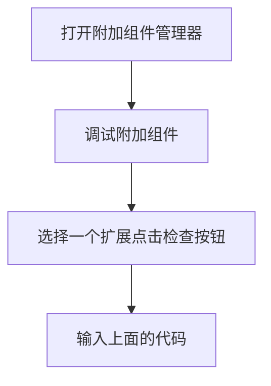

## 场景

吾辈最近开发了一个 [标签页快速切换插件](https://github.com/rxliuli/tabs_panel)，原本准备在 Chrome Store 先行上架的，不过由于 Chrome 的 [开发者注册](https://chrome.google.com/webstore/devconsole/register?hl=zh-CN) 需要 Visa 信用卡付费，所以不得已暂缓了下来。
于是，去看了一下 Firefox 的插件开发者中心，发现其并不需要收费，所以便想要兼容一下 Firefox，但吾辈却由此发现了奇怪的事情。

首先是 firefox 报的一个错误

```js
安全错误：位于 moz-extension://b0d38f9f-eca1-4163-870e-64aedabf5f20/popup.html 的内容不可以载入或者链接至 chrome://mozapps/skin/extensions/extension.svg。
```

当然，吾辈看到这个错误的第一时间是很懵逼的，因为吾辈未曾引用过 _chrome://mozapps/skin/extensions/extension.svg_ 这个 svg 图片啊，为什么会提示不可以载入呢？

## 原因

于是吾辈去看了 `browser.tabs.query` 所查询到的数据，结果。。。

```js
arr = await browser.tabs.query({})
arr.find(
  (tab) => (tab.favIconUrl = 'chrome://mozapps/skin/extensions/extension.svg'),
)
```


为什么 Firefox 的**附加组件管理器**标签页会使用 Chrome 的图标啊？难道是 Firefox 的开发团队复制 Chrome 源码的时候忘记替换了么？
抱着好玩的想法，吾辈将这个错误分享到了某个 Telegram 前端群中，有人提出了完全不同的解释：这是 Firefox 历史的遗产 -- 遠古的 XUL 留下來的 scheme，甚至在 Chrome 浏览器出现之前就已经存在了。

> 参考:
>
> - [遠古的 XUL 留下來的 scheme](https://developer.mozilla.org/en-US/docs/Archive/Mozilla/XUL/Tutorial/The_Chrome_URL)
> - [2004 年 Firefox 1.0 的介面層就叫做 chrome 惹](https://developer.mozilla.org/zh-TW/docs/Mozilla/Chrome_Registration)
> - [XUL 教学](https://developer.mozilla.org/zh-TW/docs/XUL_%E6%95%99%E5%AD%B8)

## 复现步骤

如果有人想要复现这个问题玩一下的话，具体流程如下：




## 总结

真相只有一个：Firefox 58 之后虽然号称重构了这个浏览器，但 UI 层并未抛弃掉老旧的 XUL，同时 Firefox 主要推动的 web extension api 则并未注意到这个问题（这里或许能从侧面说明 Firefox 的插件生态并不繁荣，这种问题都没有人遇到过。。。），导致了这种 **自相冲突** 的奇葩问题。
